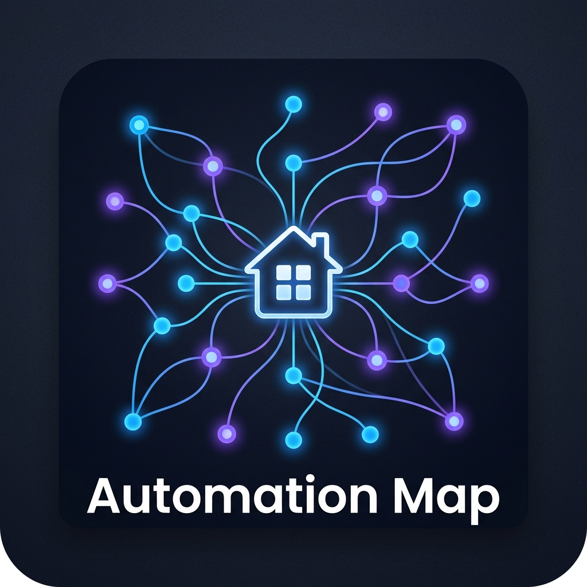

# Automation Map

<p align="center">
  
</p>

<p align="center">
  <a href="https://github.com/hacs/integration"></a>
  <a href="https://github.com/MovingLlama/automation-map/releases/"></a>
  <a href="https://github.com/MovingLlama/automation-map/actions/workflows/validate.yml"></a>
  <a href="https://opensource.org/licenses/MIT"></a>
</p>

**Automation Map** ist eine Home Assistant Custom Integration, die eine interaktive Prozesslandkarte aller Automatisierungen, Entitäten und Helfer als Graph-Visualisierung in der HA-Seitenleiste anzeigt.


---

## ✨ Features

- 🗺️ **Interaktiver Graph** — Knoten & Kanten zwischen Automatisierungen, Entitäten und Helfern
- ⚡ **Live-Werte** — Zustandsänderungen werden in Echtzeit via WebSocket aktualisiert
- 🏠 **Gruppen nach Bereichen** — Automatische Gruppierung nach Home Assistant Areas
- 🔍 **Suche & Filter** — Nach Typ (Automatisierung, Entität, Helfer) und Name filtern
- 📋 **Detail-Panel** — Klick auf Automatisierung zeigt Trigger, Bedingungen und Aktionen
- 🔗 **Navigation** — Direktlink in den HA-Editor für jede Automatisierung/Entität
- 🌓 **Adaptives Theme** — Folgt automatisch dem HA-Theme (hell/dunkel)
- 📦 **HACS-kompatibel** — Einfache Installation über HACS

---

## 📦 Installation

### Option 1: HACS (empfohlen)

1. HACS in Home Assistant installiert haben
2. In HACS → Integrationen → ⋮ → Benutzerdefinierte Repositories
3. Repository URL eintragen: `https://github.com/MovingLlama/automation-map`
4. Kategorie: **Integration** → Hinzufügen
5. "Automation Map" in HACS suchen und installieren
6. Home Assistant neu starten
7. Einstellungen → Integrationen → Integration hinzufügen → **Automation Map**

### Option 2: Manuelle Installation

1. Den Ordner `custom_components/automation_map` in deinen HA-`custom_components`-Ordner kopieren:
   ```
   /config/custom_components/automation_map/
   ```
2. Home Assistant neu starten
3. Einstellungen → Integrationen → Integration hinzufügen → **Automation Map**

---

## 🚀 Verwendung

Nach der Installation erscheint **🗺️ Automation Map** in der HA-Seitenleiste.

### Graph-Navigation
- **Zoomen**: Mausrad oder Pinch-to-zoom
- **Panning**: Klicken und ziehen
- **Übersicht**: Button „Übersicht" in der Toolbar
- **Neu anordnen**: Button „Neu anordnen" für ein frisches Layout

### Detail-Panel
- Klicke auf einen **Automatisierungs-Knoten** → siehst alle Trigger, Bedingungen und Aktionen mit echten Werten
- Klicke auf einen **Entitäts-Knoten** → siehst den aktuellen Zustand und Attribute
- **Link „In HA öffnen"** springt direkt in den HA-Editor

### Filter
- **⚡ Automationen**: Automatisierungsknoten ein-/ausblenden
- **📡 Entitäten**: Gerät-/Sensor-Knoten ein-/ausblenden
- **🔷 Helfer**: Input-Helper-Knoten ein-/ausblenden
- **Suche**: Freitext-Suche nach Name oder Entity-ID

---

## 🎨 Graph-Legende

| Farbe | Typ |
|-------|-----|
| 🔵 Blau | Automatisierung |
| 🟡 Gelb | Licht |
| 🟢 Grün | Rolladen / Markise |
| 🟣 Lila | Klimaanlage |
| ⚪ Grau | Sensor |
| 💜 Violett | Helfer |

| Kante | Bedeutung |
|-------|-----------|
| — Hellblau | Trigger (Sensor → Automatisierung) |
| — Lila | Aktion (Automatisierung → Gerät) |

---

## 🔧 Voraussetzungen

- Home Assistant 2024.1.0 oder neuer
- Moderner Browser (Chrome, Firefox, Edge, Safari)
- Internetverbindung für die erste Cytoscape.js-Bibliothek (CDN)

> **Hinweis**: Das Panel lädt die Cytoscape.js-Bibliothek von einem CDN. In einer zukünftigen Version wird diese lokal gebündelt werden.

---

## 🐛 Fehler melden

Fehler und Feature-Wünsche bitte unter [GitHub Issues](https://github.com/MovingLlama/automation-map/issues) melden.

---

## 📄 Lizenz

MIT License — siehe [LICENSE](./LICENSE)

---

## 🙏 Danksagung

- [Home Assistant](https://www.home-assistant.io/) — Das großartige Smart-Home-Ökosystem
- [Cytoscape.js](https://js.cytoscape.org/) — Graph-Visualisierungsbibliothek
- [HACS](https://hacs.xyz/) — Home Assistant Community Store
